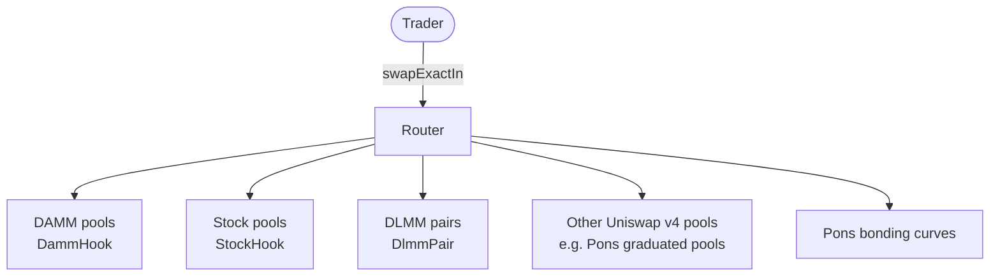
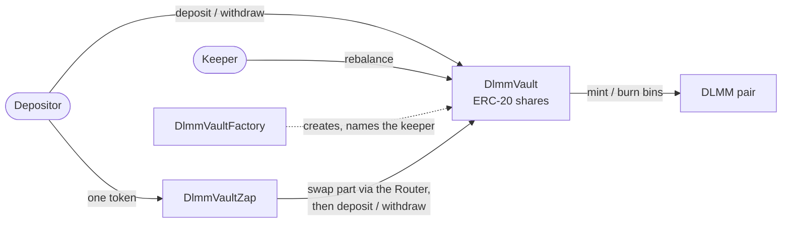
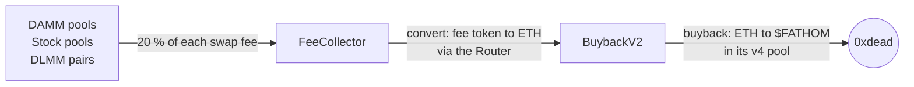

<p align="center">
  
</p>

<h1 align="center">Fathom contracts</h1>

<p align="center">
  The liquidity layer for Robinhood Chain.<br>
  <a href="https://fathompools.xyz">fathompools.xyz</a> ·
  <a href="https://x.com/FathomPools">@FathomPools</a> ·
  <a href="https://robinhoodchain.blockscout.com">Robinhood Chain explorer</a>
</p>

---

This repository holds the smart contracts behind [Fathom](https://fathompools.xyz), exactly as they
are deployed on **Robinhood Chain mainnet** (chain id 4663), with an explanation of what each one does.

Fathom gives Robinhood Chain three kinds of liquidity pools, auto-rebalancing vaults on top of them
and one router across all of them:

- **DAMM pools**: permissionless Uniswap v4 pools whose fee moves with volatility (Meteora DAMM v2
  style), with an optional anti-snipe fee at launch.
- **Stock pools**: Uniswap v4 pools for tokenized stocks, guarded by Chainlink. The pool price has
  to stay inside a band around the oracle price, and the fee follows the US market session.
- **DLMM pairs**: a discrete-bin, concentrated-liquidity AMM in the Liquidity Book design, with
  bin-range positions held as NFTs.
- **DLMM vaults**: ERC-20 vaults that hold one DLMM position and lay it out again around the price
  when the price moves away. Rebalancing never swaps and the vaults charge no fee. A zap deposits
  into a vault with a single token (or native ETH) and withdraws as a single token.
- **Router**: one exact-input, multi-hop router across all three venues, any other Uniswap v4 pool
  and Pons bonding curves.

A share of every swap fee goes to the protocol. It is converted to ETH and used to buy back and
burn the **$FATHOM** token.

> [!NOTE]
> The contracts are immutable: no proxies, no upgrades. The owner key cannot touch anyone's
> liquidity, and removing liquidity is never paused. See [Admin powers](#admin-powers) and
> [SECURITY.md](SECURITY.md).

## Contents

- [Deployed contracts](#deployed-contracts)
- [How it fits together](#how-it-fits-together)
- [The contracts](#the-contracts)
  - [ProtocolConfig](#protocolconfig)
  - [AssetRegistry](#assetregistry)
  - [FathomHookBase](#fathomhookbase)
  - [DammHook](#dammhook)
  - [StockHook](#stockhook)
  - [HookDeployer](#hookdeployer)
  - [DlmmFactory](#dlmmfactory)
  - [DlmmPair](#dlmmpair)
  - [DlmmPositionNFT](#dlmmpositionnft)
  - [DlmmVaultFactory](#dlmmvaultfactory)
  - [DlmmVault](#dlmmvault)
  - [DlmmVaultZap](#dlmmvaultzap)
  - [Router and PonsAdapter](#router-and-ponsadapter)
  - [FeeCollector](#feecollector)
  - [BuybackV2](#buybackv2)
  - [Buyback (v1, retired)](#buyback-v1-retired)
- [Fees](#fees)
- [Admin powers](#admin-powers)
- [Safety guards](#safety-guards)
- [Verification](#verification)
- [Building and testing](#building-and-testing)
- [Repository layout](#repository-layout)
- [License](#license)

## Deployed contracts

Robinhood Chain mainnet, chain id 4663, deployed from block 72 268 876. The same addresses are in
[`deployments/robinhood.json`](deployments/robinhood.json). Every contract's source is verified on
both [Blockscout](https://robinhoodchain.blockscout.com) (the address links open the verified code)
and [Sourcify](https://sourcify.dev), and the source in this repository is byte-identical to the
verified source (see [Verification](#verification)).

| Contract | Address (verified on Blockscout) | Verified source (Sourcify) | Role |
|---|---|---|---|
| ProtocolConfig | [`0xf5c7A7F883d64fa0041FBEB4459E756670bf50a7`](https://robinhoodchain.blockscout.com/address/0xf5c7A7F883d64fa0041FBEB4459E756670bf50a7?tab=contract) | [Sourcify](https://repo.sourcify.dev/4663/0xf5c7A7F883d64fa0041FBEB4459E756670bf50a7) | Owner, pause switch, protocol fee share |
| AssetRegistry | [`0xA2cCfA083823A24D10987dD985f72978da614ea9`](https://robinhoodchain.blockscout.com/address/0xA2cCfA083823A24D10987dD985f72978da614ea9?tab=contract) | [Sourcify](https://repo.sourcify.dev/4663/0xA2cCfA083823A24D10987dD985f72978da614ea9) | Stock tokens, Chainlink feeds, risk parameters, market hours |
| DammHook | [`0x13dEa09a13fDF2C32E6CFe0b5A50C4C47AA1a8cC`](https://robinhoodchain.blockscout.com/address/0x13dEa09a13fDF2C32E6CFe0b5A50C4C47AA1a8cC?tab=contract) | [Sourcify](https://repo.sourcify.dev/4663/0x13dEa09a13fDF2C32E6CFe0b5A50C4C47AA1a8cC) | Uniswap v4 hook: dynamic-fee DAMM pools |
| StockHook | [`0xa8122E55fbcb3F81cdC5418aeBd77351C0e568cC`](https://robinhoodchain.blockscout.com/address/0xa8122E55fbcb3F81cdC5418aeBd77351C0e568cC?tab=contract) | [Sourcify](https://repo.sourcify.dev/4663/0xa8122E55fbcb3F81cdC5418aeBd77351C0e568cC) | Uniswap v4 hook: oracle-guarded stock pools |
| DlmmFactory | [`0x4B104E75B478B28492873e5Fb2BB0190166d296F`](https://robinhoodchain.blockscout.com/address/0x4B104E75B478B28492873e5Fb2BB0190166d296F?tab=contract) | [Sourcify](https://repo.sourcify.dev/4663/0x4B104E75B478B28492873e5Fb2BB0190166d296F) | Creates DLMM pairs |
| DlmmPositionNFT | [`0x916617697B1D782Ac59EE76378E86f7c2Ed3970D`](https://robinhoodchain.blockscout.com/address/0x916617697B1D782Ac59EE76378E86f7c2Ed3970D?tab=contract) | [Sourcify](https://repo.sourcify.dev/4663/0x916617697B1D782Ac59EE76378E86f7c2Ed3970D) | ERC-721 DLMM positions (`FTHM-DLMM`) |
| Router | [`0x2303cC5a9CCdDBA50daf04aeece372Fd99813F8B`](https://robinhoodchain.blockscout.com/address/0x2303cC5a9CCdDBA50daf04aeece372Fd99813F8B?tab=contract) | [Sourcify](https://repo.sourcify.dev/4663/0x2303cC5a9CCdDBA50daf04aeece372Fd99813F8B) | Multi-hop swaps across every venue |
| FeeCollector | [`0x51F34Ca37DD144a7709ee81c21AC7e850BC3A453`](https://robinhoodchain.blockscout.com/address/0x51F34Ca37DD144a7709ee81c21AC7e850BC3A453?tab=contract) | [Sourcify](https://repo.sourcify.dev/4663/0x51F34Ca37DD144a7709ee81c21AC7e850BC3A453) | Receives protocol fees, converts them to ETH |
| Buyback | [`0x8b3d718843fd9167a52BDed64554131e39b4042F`](https://robinhoodchain.blockscout.com/address/0x8b3d718843fd9167a52BDed64554131e39b4042F?tab=contract) | [Sourcify](https://repo.sourcify.dev/4663/0x8b3d718843fd9167a52BDed64554131e39b4042F) | First buyback (v1), replaced by BuybackV2 |
| BuybackV2 | [`0xCe83cbF571efdFFbF0e67Cb9dA529679E05986Fa`](https://robinhoodchain.blockscout.com/address/0xCe83cbF571efdFFbF0e67Cb9dA529679E05986Fa?tab=contract) | [Sourcify](https://repo.sourcify.dev/4663/0xCe83cbF571efdFFbF0e67Cb9dA529679E05986Fa) | Buys $FATHOM with ETH and burns it; receives the fee ETH |
| DlmmVaultFactory | [`0x6FeBd590AB58EcfcB227047bACa183Fd948eAb18`](https://robinhoodchain.blockscout.com/address/0x6FeBd590AB58EcfcB227047bACa183Fd948eAb18?tab=contract) | [Sourcify](https://repo.sourcify.dev/4663/0x6FeBd590AB58EcfcB227047bACa183Fd948eAb18) | Creates DLMM vaults, names the keeper |
| DlmmVault (WETH / USDG) | [`0x9DACCa4aAE3BC2f785e5D3F6302855c6042F7B66`](https://robinhoodchain.blockscout.com/address/0x9DACCa4aAE3BC2f785e5D3F6302855c6042F7B66?tab=contract) | [Sourcify](https://repo.sourcify.dev/4663/0x9DACCa4aAE3BC2f785e5D3F6302855c6042F7B66) | Auto-rebalancing vault on the WETH / USDG DLMM pair (`fvWETH-USDG`) |
| DlmmVaultZap | [`0x50855565aB1a3f860FCdBAaF87552357fF2d6f8A`](https://robinhoodchain.blockscout.com/address/0x50855565aB1a3f860FCdBAaF87552357fF2d6f8A?tab=contract) | [Sourcify](https://repo.sourcify.dev/4663/0x50855565aB1a3f860FCdBAaF87552357fF2d6f8A) | One-token deposits into and withdrawals out of the vaults |

Owner of every owned contract (`ProtocolConfig`, `AssetRegistry`, `FeeCollector`, `Buyback`, `BuybackV2`):
[`0x29A99360467CEB0D726450A09337b19A9D2ac5b7`](https://robinhoodchain.blockscout.com/address/0x29A99360467CEB0D726450A09337b19A9D2ac5b7), the deployer.
Ownership uses `Ownable2Step`, so a transfer only completes when the new owner accepts it. The vault
factory has no owner of its own: it follows the `ProtocolConfig` owner.

The vault contracts were deployed later than the rest (block 76 785 672) by
[`script/DeployVaults.s.sol`](script/DeployVaults.s.sol). The vault keeper is
[`0xD5eBe812E36f7C6eC0b1A802fBefC294954bFD38`](https://robinhoodchain.blockscout.com/address/0xD5eBe812E36f7C6eC0b1A802fBefC294954bFD38),
an automated account that only calls `rebalance`. The zap was deployed at block 76 834 101 by
[`script/DeployZap.s.sol`](script/DeployZap.s.sol). BuybackV2 was deployed at block 77 468 055 by
[`script/DeployBuybackV2.s.sol`](script/DeployBuybackV2.s.sol), which in the same run configured it on the
$FATHOM pool, pointed the FeeCollector at it and added the WETH fee route.

### Launch pools

Created by [`script/Seed.s.sol`](script/Seed.s.sol) right after deployment. All v4 pools use the
dynamic-fee flag (`0x800000`) and tick spacing 60; pool ids are `keccak256(abi.encode(PoolKey))`.

| Pool | Venue | Pool id / address |
|---|---|---|
| ETH / USDG | DAMM (base fee 30 bps, no snipe window, `variableFeeControl` 10 000) | `0x94cf7adb013cec4701270d81f271680cc02c40590c107e2c5a7f0950f9a59c94` |
| NVDA / USDG | Stock | `0x30e20529f6e096429a9abbe8b1be28ea1483852e8e1f383705c15ef58fab153a` |
| MSFT / USDG | Stock | `0x8b9685b67b9ab38b32291f898b5f0d729cefda265ea8b8912400529ecccbb5b6` |
| AAPL / USDG | Stock | `0xc179485724d1a6d8371f13db06e0d469e18c5a6d4c9e542215bb983faea2a10e` |
| GOOGL / USDG | Stock | `0xfde4ed416f71ed97c286aec5f65b4a3124c90eac0f48ae22a30fffc05af09980` |
| AMZN / USDG | Stock | `0xb7eeed417e71e459aee0fb30ccbdd0d469c99cfb8e7bf7f7134375a4cfc088e8` |
| WETH / USDG | DLMM pair, bin step 10 | [`0xFded0De76C38B1d94dc1910A4BD4e221c98e4923`](https://robinhoodchain.blockscout.com/address/0xFded0De76C38B1d94dc1910A4BD4e221c98e4923?tab=contract) ([Sourcify](https://repo.sourcify.dev/4663/0xFded0De76C38B1d94dc1910A4BD4e221c98e4923)) |

Anyone can create more DAMM pools and DLMM pairs, and more stock pools for any registered stock.

### External contracts

Canonical Robinhood Chain contracts Fathom talks to. All of them, plus the 35 stock tokens and their
Chainlink feeds, are in [`script/RobinhoodAddresses.sol`](script/RobinhoodAddresses.sol).

| Contract | Address |
|---|---|
| Uniswap v4 PoolManager | [`0x8366a39CC670B4001A1121B8F6A443A643e40951`](https://robinhoodchain.blockscout.com/address/0x8366a39CC670B4001A1121B8F6A443A643e40951) |
| Uniswap v4 PositionManager (LP NFTs for DAMM and stock pools) | [`0x58daec3116aae6D93017bAAea7749052E8a04fA7`](https://robinhoodchain.blockscout.com/address/0x58daec3116aae6D93017bAAea7749052E8a04fA7) |
| WETH | [`0x0Bd7D308f8E1639FAb988df18A8011f41EAcAD73`](https://robinhoodchain.blockscout.com/address/0x0Bd7D308f8E1639FAb988df18A8011f41EAcAD73) |
| USDG (6 decimals) | [`0x5fc5360D0400a0Fd4f2af552ADD042D716F1d168`](https://robinhoodchain.blockscout.com/address/0x5fc5360D0400a0Fd4f2af552ADD042D716F1d168) |
| Chainlink ETH / USD | [`0x78F3556b67E17Df817D51Ef5a990cDaF09E8d3A9`](https://robinhoodchain.blockscout.com/address/0x78F3556b67E17Df817D51Ef5a990cDaF09E8d3A9) |
| Pons factory | [`0x7eD598BcEf8bd9Edd8C97A195C6d13f40801EC7e`](https://robinhoodchain.blockscout.com/address/0x7eD598BcEf8bd9Edd8C97A195C6d13f40801EC7e) |

## How it fits together

**Trading.** Traders swap through the Router, or directly with a pool. LPs hold a standard Uniswap v4
PositionManager NFT in DAMM and stock pools, and a `DlmmPositionNFT` in DLMM pairs.



Every Fathom venue reads `ProtocolConfig` (pause switch, protocol fee share); stock pools also read
`AssetRegistry` (Chainlink price, market session, fee and band).

**Vaults.** A `DlmmVault` is an LP like any other in its DLMM pair: it holds pair shares in a range of
bins and issues ERC-20 shares for them. The keeper moves that range when the price moves away.



**Fees.** The protocol share of every swap fee ends up as burned $FATHOM.



1. A trader swaps through the **Router**, or directly with a pool. Routes are chosen off-chain by
   quoting every venue (`Router.quoteExactIn`).
2. Each venue charges its fee on the swap input. The LP part stays in the pool. The protocol part
   (`ProtocolConfig.protocolFeeShareBps`, 20 % of the fee) goes straight to the **FeeCollector**.
3. Anyone can call `FeeCollector.convert(token)`. It swaps collected fees to ETH through the Router
   with an oracle-bounded minimum, and the ETH goes straight to the **BuybackV2**.
4. Anyone can call `BuybackV2.buyback()` once per block, optionally adding ETH of their own. It
   spends a capped amount of ETH on $FATHOM in its ETH pool, guarded against buying into a pump, and
   every token bought goes from the PoolManager straight to `0xdead`.

## The contracts

All sources are in `src/`, Solidity 0.8.26, MIT licensed. Nothing is upgradeable. `address(0)`
means native ETH everywhere.

### ProtocolConfig

[`src/core/ProtocolConfig.sol`](src/core/ProtocolConfig.sol)

The shared settings every venue reads. It holds three things:

| Setting | Current value | Bounds |
|---|---|---|
| `paused` | `false` | When `true`, swaps and new liquidity revert on every venue. Removing liquidity is never checked against it. |
| `feeCollector` | FeeCollector | Non-zero. Where every venue sends the protocol share of fees. |
| `protocolFeeShareBps` | 2 000 (20 % of each swap fee) | At most 5 000 (50 %). |

The owner of `ProtocolConfig` is also the only account that may change DLMM bin-step presets.

### AssetRegistry

[`src/core/AssetRegistry.sol`](src/core/AssetRegistry.sol)

The curated list of oracle-priced assets (tokenized stocks now, other real-world assets later) and
the quote tokens they may be paired with. Only assets in this registry can get a stock pool.

**Assets.** Each asset has an asset class (`STOCK` or `RWA`), a Chainlink USD feed, a heartbeat (the
maximum age before its price counts as stale) and risk parameters:

| Parameter | Meaning | Deployed value (all 35 stocks) |
|---|---|---|
| `openFeeBps` | Swap fee while the US market is open | 30 bps |
| `closedFeeBps` | Swap fee while it is closed | 150 bps |
| `staleFeeBps` | Swap fee while the oracle is stale | 500 bps |
| `openMaxDevBps` | Max distance of the pool price from the oracle price while open | 200 bps (2 %) |
| `closedMaxDevBps` | Same, while closed or stale | 50 bps (0.5 %) |
| `heartbeat` | Max oracle age | 90 000 s (25 h; the feeds update at least every 24 h) |

Fees are capped at 1 000 bps (10 %) by the contract. The registry holds 35 stock tokens, every
Robinhood stock token that has a Chainlink feed on chain 4663 (NVDA, MSFT, AAPL, GOOGL, AMZN, META,
TSM, TSLA, SPY, QQQ and more; the full list is in `script/RobinhoodAddresses.sol`).

**Quotes.** USDG is pegged at exactly $1 (no feed). Native ETH and WETH are priced by Chainlink
ETH / USD.

**Market session.** `isMarketOpen()` is true Monday to Friday between `sessionOpenUtc` and
`sessionCloseUtc`, except on days the owner marked as a holiday. The current window is
13:30–20:00 UTC, which is the NYSE regular session (09:30–16:00 New York time) during US daylight
saving time; the owner shifts it by one hour when the clocks change.

**Reads.** `assetPrice` and `quotePrice` return a USD price with 18 decimals and a `stale` flag, and
revert on a non-positive answer. `riskParams(asset)` returns the fee and max deviation that apply
right now, together with the oracle and session state.

### FathomHookBase

[`src/hooks/FathomHookBase.sol`](src/hooks/FathomHookBase.sol)

The shared base of the two Uniswap v4 hooks. It decides which v4 callbacks the hooks use and how
fees are split.

- **Permissions:** `beforeInitialize`, `beforeAddLiquidity`, `beforeSwap`, `afterSwap` and the two
  swap return-delta flags. There is deliberately **no `beforeRemoveLiquidity`**, so a hook can never
  block an LP from withdrawing.
- **Pool creation** goes through the hook's own `createPool` only (`beforeInitialize` rejects any
  other caller), and the pool must use the dynamic-fee flag.
- **Pause:** adding liquidity and swapping revert while `ProtocolConfig.paused` is set.
- **Fee split:** each hook computes a total fee. `protocolFeeShareBps` of it is the protocol part,
  the rest is the LP part. The LP part is handed to the PoolManager as the swap's dynamic LP fee, so
  it accrues to LPs exactly like a normal Uniswap v4 fee. The protocol part is taken by the hook on
  the swap's input currency: in `beforeSwap` for exact-input swaps (taken off the input before the
  pool swaps), in `afterSwap` for exact-output swaps.
- **Fee delivery:** the protocol part is sent straight to the FeeCollector with `poolManager.take`.
  If the PoolManager does not hold enough of that currency at that moment (the trader settles after
  the swap), the hook mints an ERC-6909 claim to itself instead, and anyone can call
  `sweep(currency)` later to redeem it to the FeeCollector.

### DammHook

[`src/hooks/DammHook.sol`](src/hooks/DammHook.sol)

Permissionless dynamic-fee pools, modelled on Meteora DAMM v2. Anyone can create a pool for any
token pair with `createPool(key, sqrtPriceX96, params)`:

| Parameter | Range | Meaning |
|---|---|---|
| `baseFeeBps` | 5–100 | The pool's normal fee |
| `snipeSeconds` | 0–3 600 | Length of the anti-snipe window after creation (0 = off) |
| `snipeStartFeeBps` | base–5 000 | Fee at the moment of creation; decays linearly to the base fee over `snipeSeconds` |
| `variableFeeControl` | any | Strength of the volatility surcharge (0 = off; 10 000 adds about 10 bps after a 100-tick move) |

The fee of a swap is the scheduled fee (the base fee, or the decaying snipe fee inside the window)
plus a volatility surcharge of `variableFeeControl × vol² / 1e5` pips. `vol` accumulates the
absolute tick movement of every swap and decays linearly to zero over 600 seconds, so the fee rises
during sharp moves and falls back when the market calms down. The total is capped at 500 bps (5 %)
outside the snipe window.

`currentFee(poolId)` returns the fee that would apply right now (LP part and total). Events:
`DammPoolCreated` and, on every swap, `DammSwapFee`.

### StockHook

[`src/hooks/StockHook.sol`](src/hooks/StockHook.sol)

Uniswap v4 pools for tokenized stocks whose price is anchored to Chainlink.

**Creation.** `createPool(key, sqrtPriceX96)` is permissionless, but one side of the pool must be an
enabled `AssetRegistry` asset and the other an enabled quote (USDG, ETH or WETH). Passing
`sqrtPriceX96 = 0` starts the pool at the oracle price; any other start price must be inside the
oracle band.

**Every swap:**

1. The hook reads the asset's and the quote's USD prices and computes the oracle price of the pool
   (adjusted for both tokens' decimals) and a band of ± `maxDevBps` around it.
2. The fee comes from `AssetRegistry.riskParams`: 30 bps while the market is open, 150 bps while it
   is closed, 500 bps while the asset or quote oracle is stale. It is split between LPs and the
   protocol like in every Fathom venue.
3. After the swap, the pool price must be inside the band. A swap that ends outside the band is
   only allowed if it moved the price **strictly closer** to the oracle price, so arbitrageurs can
   always pull a drifted pool back. Otherwise it reverts with `PriceOutOfBand`.
4. While an oracle is stale, only swaps that move the price toward the last oracle price are
   allowed (`StaleAwayFromOracle` otherwise).

So trading continues around the clock, but outside market hours the band is tighter (0.5 %
instead of 2 %) and the fee is higher, which protects LPs from trading against stale prices.

Views: `bandSqrtPrices(poolId)` and `oracleState(poolId)` (oracle price, fee, session and
staleness). Event on every swap: `StockSwap`.

### HookDeployer

[`src/hooks/HookDeployer.sol`](src/hooks/HookDeployer.sol)

A library used only by the deploy script and the tests, not a deployed contract. A Uniswap v4 hook's
address must encode its permissions in its lowest bits, so the hooks are deployed with CREATE2
through the standard deterministic deployer (`0x4e59b44847b379578588920cA78FbF26c0B4956C`) with a salt
mined by `HookMiner` until the address carries exactly the permission flags above.

### DlmmFactory

[`src/dlmm/DlmmFactory.sol`](src/dlmm/DlmmFactory.sol)

Creates DLMM pairs. `createPair(tokenX, tokenY, binStep, activeId)` is permissionless (except while
paused): one pair per token pair and bin step, deployed with CREATE2 so the address is predictable.
`getPair`, `isPair` and `allPairs` index them.

The bin step is the price distance between two neighbouring bins, in bps. Only bin steps with an
enabled preset can be used. Each preset holds the pair's fee parameters, which are copied into the
pair at creation (a later preset change only affects new pairs):

| Bin step | Base fee | Variable fee at max volatility |
|---|---|---|
| 1 | 2 bps | ≈ 1 % |
| 5 | 5 bps | ≈ 1 % |
| 10 | 10 bps | ≈ 1 % |
| 25 | 20 bps | ≈ 1 % |
| 50 | 40 bps | ≈ 1 % |
| 100 | 80 bps | ≈ 1 % |

Shared by all presets: filter period 30 s, decay period 600 s, reduction factor 50 %, max
volatility accumulator 350 000. The total fee is capped at 10 % by the pair.

### DlmmPair

[`src/dlmm/DlmmPair.sol`](src/dlmm/DlmmPair.sol) with
[`src/libraries/BinMath.sol`](src/libraries/BinMath.sol) and
[`src/libraries/BinTree.sol`](src/libraries/BinTree.sol)

A discrete-bin AMM written from scratch after the Liquidity Book v2.1 design.

**Bins.** Liquidity sits in bins. Bin `id` has the fixed price
`price(id) = (1 + binStep / 10 000) ^ (id − 2²³)` (Y per X in raw units, 128.128 fixed point,
computed by `BinMath`). Inside one bin the price does not move: a swap there is a constant-sum
exchange at that bin's price. The **active bin** holds both tokens, bins below it hold only Y and
bins above it hold only X.

**Swaps.** `swap(swapForY, to)` follows the "pay first" pattern: the input is sent to the pair
first, and the pair measures it from its balance. The swap uses up the active bin, then jumps to the
next bin that holds liquidity. `BinTree`, a three-level 256-ary bitmap over the 24-bit id space,
finds that bin in a constant number of storage reads. `getSwapOut` quotes a swap without executing
it.

**Fees.** Charged on the input token, bin by bin:

- base fee = `baseFactor × binStep × 1e10` (1e18 = 100 %),
- variable fee = `(volatilityAccumulator × binStep)² × variableFeeControl / 100`.

The volatility accumulator grows with the number of bins a swap crosses, and decays between swaps
(after `filterPeriod` it is cut by `reductionFactor`, after `decayPeriod` it resets). The LP part of
the fee stays in the bin, so LPs collect it when they withdraw. The protocol part is transferred to
the FeeCollector on every swap.

**Liquidity.** `mint(to, ids, distributionX, distributionY)` deposits tokens already sent to the pair
across the given bins (the distributions are 1e18-scaled shares of the tokens received; unused
tokens are refunded). X can only go into bins at or above the active bin, Y only at or below it.
Shares are tracked per (bin, owner). `burn(from, to, ids, amounts)` withdraws them and **never checks
the pause flag**.

**Composition fee.** Depositing into the active bin with a different X:Y mix than the bin holds is
partly a swap. Without a fee, a deposit followed by an immediate withdrawal would be a fee-free swap.
So that implied swap pays the normal swap fee (Liquidity Book v2.1 `getCompositionFees`), which stays
with the bin's existing LPs except for the protocol share.

### DlmmPositionNFT

[`src/dlmm/DlmmPositionNFT.sol`](src/dlmm/DlmmPositionNFT.sol)

The way LPs normally use DLMM pairs. An ERC-721 ("Fathom DLMM Position", `FTHM-DLMM`) over a
contiguous bin range: the NFT contract holds the pair shares and each token id records its share
per bin.

- `mint(pair, lowerId, upperId, amountX, amountY, distributionX, distributionY, to, guard)` pulls
  the tokens, deposits them over the range and mints the NFT. Unused tokens are refunded.
- `increase` adds to an existing position over the same range.
- `decrease(tokenId, bps, to, amountXMin, amountYMin, deadline)` withdraws a fraction of every bin,
  including the fees earned. `burn` withdraws everything and burns the NFT.

Every deposit carries a `DepositGuard`: the deadline, the active bin the caller priced against plus
an allowed slippage in bins, and minimum amounts that must actually land in the bins. Withdrawals take
minimum amounts and a deadline. Together these stop a sandwich attack from moving the price between
signing and execution. Only the NFT owner or an approved address can change a position.

### DlmmVaultFactory

[`src/vaults/DlmmVaultFactory.sol`](src/vaults/DlmmVaultFactory.sol)

Creates the vaults and holds the keeper address they accept rebalances from. Both
`createVault(pair, halfWidth, shape)` and `setKeeper(keeper)` are restricted to the `ProtocolConfig`
owner, so the vault list is curated. There is one vault per (pair, half width, shape), deployed with
CREATE2 from those three values; `getVault`, `isVault`, `allVaults` and `getVaults()` index them.

The factory itself was deployed with CREATE2 through the standard deterministic deployer
(`0x4e59b44847b379578588920cA78FbF26c0B4956C`), so its address was fixed before it went on chain.

### DlmmVault

[`src/vaults/DlmmVault.sol`](src/vaults/DlmmVault.sol)

An auto-rebalancing position in one DLMM pair. The vault holds pair shares over
`[lowerId, upperId] = activeId ± halfWidth` and issues ERC-20 shares ("Fathom Vault X-Y", `fvX-Y`,
with the decimals of token Y). Swap fees earned by its bins stay in the bins and compound. The vault
charges no fee of its own.

| Parameter | WETH / USDG vault | Bounds |
|---|---|---|
| `halfWidth` | 20 bins each side (41 bins, ± 2 % at bin step 10) | 1–50 |
| `shape` | 0, Spot (equal weight per bin) | 0 Spot, 1 Curve (weight falls off with distance from the active bin), 2 Bid-Ask (weight grows with distance) |

**Deposit.** `deposit(amountXMax, amountYMax, minShares, to, activeIdDesired, idSlippage, deadline)`.

- The first deposit opens the range around the active bin, lays the tokens out with the vault's
  shape and mints shares equal to the deposit's value in Y at the active price. 1 000 shares are
  locked at `0xdead` so the share price cannot be inflated by a tiny first deposit plus a donation.
- Every later deposit takes both tokens in the vault's current X:Y mix (the largest amount both
  maxima can pay for) and pulls only what it takes. It is added to every bin in the same proportion
  the vault already holds there, and the slice of the idle balance stays idle. A deposit is therefore
  an exact slice of the vault: share pricing needs no price at all, and moving the pool price before a
  deposit cannot dilute existing holders (covered by a test that deposits between a price push and its
  reversal).
- Bins where a deposit would mint dust pair shares are skipped; those tokens stay idle in the vault
  and still count toward its total.
- Guards: deadline, active bin within `idSlippage` of `activeIdDesired`, `minShares`. Deposits
  revert while the protocol is paused.

**Withdraw.** `withdraw(shares, to, amountXMin, amountYMin, deadline)` burns the shares and sends
their slice of every bin and of the idle balance, fees included, straight to `to`. It **never checks
the pause flag**.

**Rebalance.** `rebalance(activeIdDesired, idSlippage)` pulls every bin of the position and lays the
whole balance out again over the active bin ± `halfWidth` with the vault's shape: X at and above the
active bin, Y at and below it, the only mix the pair accepts from any LP. It **never swaps**, so the
vault keeps the tokens it had. The active bin only receives its own current X:Y ratio, so the
deposit is not part swap and pays no composition fee; what does not fit moves one bin out on its own
side. A rebalance is only allowed when

1. the caller is the factory's keeper or the `ProtocolConfig` owner,
2. the active bin is more than `halfWidth / 2` bins from the centre of the current range,
3. at least `MIN_REBALANCE_INTERVAL` (5 minutes) has passed since the last one,
4. the active bin is within `idSlippage` of `activeIdDesired`, and the protocol is not paused.

The keeper runs off-chain and only rebalances once condition 2 has held for about two minutes, so a
price pushed within a block or two does not trigger it.

**Views.** `getTotalAmounts()` (idle balance plus the vault's share of every bin), `getBins()` (per-bin
amounts), `needsRebalance()`, `previewDeposit` and `previewWithdraw`. Events: `Deposit`, `Withdraw`,
`Rebalance`.

### DlmmVaultZap

[`src/vaults/DlmmVaultZap.sol`](src/vaults/DlmmVaultZap.sol)

Single-token entry to and exit from the vaults, in one transaction. The zap has no owner, holds
nothing between calls and only accepts vaults created by `DlmmVaultFactory` (`isVault`).

- `zapIn(params)` takes one of the vault's tokens, or native ETH for a WETH side (wrapped on
  entry), swaps `swapAmount` of it into the vault's other token through the Router along the given
  route, and deposits both into the vault for `to`. The vault takes its own X:Y mix, and whatever it
  does not take goes back to the caller, unwrapped to ETH if the caller paid in ETH.
- `zapOut(params)` pulls vault shares from the caller (approved to the zap), withdraws them, swaps
  the side the caller does not want through the Router and sends the whole amount to `to` in one
  token, or native ETH.

The caller computes the route and the split off-chain (the app swaps
`s = A · tO / (tO + tT · rate)` of an input `A`, where `tT` / `tO` are the vault's amounts of the input
and the other token, and leaves the vault's own pair out of the route so the swap does not change the
mix it is matching). The contract checks what matters on-chain:

- the route's input and output are the right tokens (ETH and WETH are interchangeable), and the
  output is measured from the balance that actually arrives, with native ETH wrapped;
- `minSwapOut`, the vault's own `minShares` and active-bin bounds on the way in, `minOut` on the way
  out, and `deadline` on both;
- tokens and shares are only ever pulled from `msg.sender`; router and vault allowances are set to
  the exact amount and reset to zero after each call.

Events: `ZapIn`, `ZapOut`.

### Router and PonsAdapter

[`src/periphery/Router.sol`](src/periphery/Router.sol),
[`src/periphery/PonsAdapter.sol`](src/periphery/PonsAdapter.sol),
[`src/interfaces/IRouter.sol`](src/interfaces/IRouter.sol)

One exact-input router across every venue on the chain:

```solidity
function swapExactIn(Hop[] hops, uint256 amountIn, uint256 minAmountOut, address to, uint256 deadline)
    external payable returns (uint256 out);
```

A route is a list of hops. Each hop has a kind and ABI-encoded data:

| Kind | Name | `data` | Venue |
|---|---|---|---|
| 0 | `V4` | `(PoolKey key, bool zeroForOne, bytes hookData)` | Any Uniswap v4 pool: DAMM, stock, Pons graduated pools, anything else |
| 1 | `DLMM` | `(address pair, bool swapForY)` | A Fathom DLMM pair |
| 2 | `PONS_CURVE` | `(address curve, bool isBuy)` | A Pons bonding curve that has not graduated yet |
| 3 | `WETH_WRAP` | empty | Wraps or unwraps ETH ↔ WETH |

- Up to 3 swap hops per route (wrap hops do not count). `routeTokens` checks that every hop's input
  is the previous hop's output.
- Native ETH can be sent as `msg.value` and is wrapped automatically when the first hop needs WETH.
  ETH/WETH mismatches between hops are bridged automatically. A final `WETH_WRAP` hop unwraps the
  output to native ETH.
- Every v4 hop is one PoolManager `unlock` and must fill completely (`PartialFill` otherwise). The
  only price check is `minAmountOut` on the final output, plus the `deadline`.
- `quoteExactIn(hops, amountIn)` returns the exact output of a route, to be called with `eth_call`.
  v4 hops are simulated and reverted, DLMM hops use `getSwapOut`, curve hops are computed from the
  curve's reserves and fees.
- The router has no owner and holds nothing between calls: each hop's output lands in the router and
  is spent by the next hop or sent to `to` in the same transaction.

`PonsAdapter` is a library compiled into the Router. It buys and sells on Pons bonding curves
(Robinhood Chain's token launchpad) before graduation and quotes them from reserves, including the
curve fee, the creator tax and the launch snipe tax. A graduated curve reverts `PonsGraduated()`;
the token then trades in its Pons v4 pool, which the router reaches with a normal `V4` hop.

### FeeCollector

[`src/periphery/FeeCollector.sol`](src/periphery/FeeCollector.sol)

Receives the protocol share of fees from every venue, in whatever token they were paid, plus ETH.

- The owner sets a **route** per fee token with `setRoute(token, hops, maxPerCall, useOracle)`. The
  route must be a valid Router path from that token to native ETH.
- `convert(token, amount)` is **permissionless**. It swaps up to `maxPerCall` of the token through
  the Router and sends the ETH straight to the Buyback. If the route uses the oracle, the minimum
  output comes from `AssetRegistry` prices minus `maxSlippageBps` (3 %, at most 20 %), and the call
  reverts if either price is stale. Caps per call keep each conversion small relative to pool depth.
- `forwardEth()` is permissionless and sends ETH fees held by the collector to the Buyback.
- Routes on mainnet: USDG goes to ETH in the public ETH / USDG v4 pool, with the oracle floor. WETH
  goes to USDG on the WETH / USDG DLMM pair, then the same v4 hop, also with the oracle floor (a
  Router route cannot start with a bare WETH unwrap).
- `sweep` lets the owner recover a token only if it has **no** conversion route (stray or
  unsupported tokens). Tokens with a route can only leave through `convert`, into the Buyback.

### BuybackV2

[`src/periphery/BuybackV2.sol`](src/periphery/BuybackV2.sol)

Turns the ETH from fees into $FATHOM buy pressure and burns what it buys. It replaced the first
Buyback on 2026-10-01 (why: see [the next section](#buyback-v1-retired)); the FeeCollector sends its
ETH here.

- `configure(poolKey, hookData)` is a one-shot owner call that sets the ETH / $FATHOM Uniswap v4
  pool (native ETH as `currency0`; the $FATHOM Pons graduated pool). Until it is called,
  `buyback()` reverts `NotConfigured`.
- `buyback()` is **permissionless** and **payable**, and runs at most once per block. It spends up to
  `maxEthPerCall` (currently 0.05 ETH) of the ETH it holds, minus a caller reward. Anyone can send
  ETH of their own with the call, any amount, and it is spent in the same buyback. That ETH is
  emitted as `Received(sender, amount)`, so ETH from fees (sent by the Router or the FeeCollector)
  and ETH added by callers stay distinguishable on chain. A call that reverts returns the ETH sent
  with it.
- The tokens bought go directly from the PoolManager to `0xdead`; nothing is held by the contract.
  The caller receives `callerRewardBps` (0.5 %, at most 5 %) of the ETH spent, never more than was
  set aside for it.

**Price guard.** $FATHOM has no Chainlink feed, so the guard is derived from the pool itself:

- A reference price follows the pool price, but it can move by at most `driftBpsPerHour` (30 % per
  hour) of elapsed time and at most `maxDeviationBps` (10 %) per update. With no time elapsed it does
  not move at all, so a pump inside one block cannot shift it. Every `buyback()` catches the
  reference up first, and anyone can do the same with `poke()`.
- Only a price that is too high can hurt a buyer, so only that side is guarded: `buyback()` reverts
  `PriceAboveBand` if $FATHOM is more than `maxDeviationBps` above the reference (a front-running
  pump). A lower price never blocks a buyback, however old the reference is.
- The swap stops at the tighter of two limits: the edge of the reference band, and
  `maxDeviationBps` above the price the swap started from. One call never pays more than either.
  Unspent ETH stays for the next call.
- The owner can retune the guard and `resetReference()` after a large genuine repricing.

Running totals: `totalEthSpent` and `totalBurned`. Event: `BoughtBack`, the same as v1.

### Buyback (v1, retired)

[`src/periphery/Buyback.sol`](src/periphery/Buyback.sol)

The first buyback, kept in the repository because it is deployed and verified. Its price guard
was two-sided, and its reference moved only inside a successful `buyback()` or a `poke()`. After
$FATHOM fell about 21 % while nobody touched the reference, the reference sat far above the
market, and every `buyback()` reverted `PriceOutOfRange` until the reference was poked back in 10 %
steps. BuybackV2 removes that failure mode: a lower price never blocks it and every call catches the
reference up. v1 also lacks the cap on the caller reward, so a call that spends the whole balance
can revert on a 1 wei rounding difference. The FeeCollector no longer sends ETH to v1.

## Fees

| Where | Total fee | LP share | Protocol share |
|---|---|---|---|
| DAMM pool | Base 5–100 bps set by the pool creator, + volatility surcharge, max 5 % (optional anti-snipe fee up to 50 % that decays to the base fee within one hour of creation) | 80 % | 20 % |
| Stock pool | 30 bps market open, 150 bps closed, 500 bps stale oracle | 80 % | 20 % |
| DLMM pair | Base fee from the bin step + volatility fee, max 10 % | 80 % | 20 % |
| DLMM active-bin deposit | Swap fee on the implied swap part only (composition fee) | 80 % | 20 % |
| DLMM vault | none (the vault earns the pair's LP fees for its holders) | – | – |
| Vault zap | none (the swap part pays the fee of the pools it routes through) | – | – |
| Router | none | – | – |
| `BuybackV2.buyback()` caller | 0.5 % of the ETH spent, paid to the caller | – | – |

The protocol share is `ProtocolConfig.protocolFeeShareBps` (2 000 = 20 % of the fee, capped at 50 %
by the contract). All of it flows FeeCollector → ETH → BuybackV2 → burned $FATHOM.

## Admin powers

Every owned contract uses `Ownable2Step`. The owner address is listed under
[Deployed contracts](#deployed-contracts).

| Contract | The owner can | The owner cannot |
|---|---|---|
| ProtocolConfig | Pause swaps and new liquidity on every venue; change the fee collector; set the protocol share (≤ 50 % of the fee) | Block withdrawals; touch LP positions; change contract code |
| AssetRegistry | Add, update and disable stock assets and quotes; set their fees (≤ 10 %) and bands; set the market session and holidays | Change a pool's LP positions. Disabling an asset stops swaps in its stock pools; LPs can still withdraw |
| DlmmFactory (via the ProtocolConfig owner) | Enable, disable or change bin-step presets | Change the fee parameters of an existing pair |
| FeeCollector | Set conversion routes, caps and slippage; change the Buyback address; recover tokens that have **no** route | Take tokens that have a route |
| Buyback, BuybackV2 | Configure the pool once; tune the price guard (deviation ≤ 20 %, drift ≤ 100 %/h); reset the reference; set `maxEthPerCall` and the caller reward (≤ 5 %) | Withdraw ETH or tokens; point the buyback at a second pool |
| DlmmVaultFactory (via the ProtocolConfig owner) | Create vaults; set the keeper address | Touch deposits in a vault; change a vault's pair, width or shape |
| DlmmVault (keeper or ProtocolConfig owner) | `rebalance`, only under the four conditions above | Swap, withdraw or move the vault's tokens anywhere but back into its own pair; block withdrawals |
| DammHook, StockHook, DlmmPair, DlmmPositionNFT, Router, DlmmVaultZap | No owner | – |

## Safety guards

- **Withdrawals always work.** Neither hook has a remove-liquidity callback, and `DlmmPair.burn`,
  `DlmmPositionNFT.decrease` / `burn` and `DlmmVault.withdraw` never read the pause flag.
- **Vaults:** exact-slice deposits (no price in share pricing), locked minimum shares against share
  inflation, rebalances that never swap and are bounded by drift, time and active-bin slippage.
- **Oracle band on stock pools.** A swap cannot end outside ± 2 % (0.5 % when the market is closed)
  of the Chainlink price unless it moves the price toward it.
- **Stale oracles.** Stock pools charge 5 % and only accept price-correcting swaps while a feed is
  older than its heartbeat. Oracle-bounded fee conversions revert on a stale price. A non-positive
  Chainlink answer always reverts.
- **Anti-snipe and volatility fees** on DAMM pools; the volatility fee on DLMM pairs.
- **Composition fee** so an active-bin deposit plus withdrawal is never cheaper than a swap
  (covered by a fuzz test).
- **Slippage bounds everywhere a user deposits or swaps:** `minAmountOut` and `deadline` on the
  Router; active-bin slippage, minimum amounts and deadlines on DLMM positions; `minShares` on vault
  deposits; `minSwapOut`, `minShares` and `minOut` on the zap.
- **Buyback price guard:** a reference that can only move over time, a 10 % band above it (a lower
  price never blocks a buyback), a price limit on the swap itself and one buyback per block.
- **Reentrancy guards** on the DLMM pair, the position NFT, the vaults, the zap, the FeeCollector and both buybacks.

## Verification

All 14 contracts above (9 protocol contracts, the seeded DLMM pair, the vault factory, the
WETH / USDG vault, the vault zap and BuybackV2) are verified on **Blockscout** and **Sourcify** from the sources
in this repository. The source files in `src/` and
the pinned library versions under `lib/` are byte-identical to the verified sources.

Compiler settings: solc 0.8.26, EVM `cancun`, `via_ir = true`, optimizer on with 44 444 444 runs,
and no metadata hash (`bytecode_hash = "none"`, `cbor_metadata = false`). Because no metadata hash
is embedded in the bytecode, Blockscout labels the match "partial" and Sourcify "match" instead of
"full" / "exact match": that label only means the metadata hash cannot be compared.
The compiled bytecode itself matches exactly.

The vault contracts (`src/vaults`, including the zap) and BuybackV2 were compiled with the same settings but 200 optimizer runs, the
`deploy` profile in `foundry.toml` (`FOUNDRY_PROFILE=deploy forge build`, output in `out-deploy/`).

You can check it yourself. This compiles the repository and compares every contract's runtime
bytecode with the code on chain (the byte ranges of immutable values are masked):

```bash
forge build
FOUNDRY_PROFILE=deploy forge build
python3 script/check_bytecode.py
```

```
MATCH    ProtocolConfig   0xf5c7A7F883d64fa0041FBEB4459E756670bf50a7  (1915 bytes)
MATCH    AssetRegistry    0xA2cCfA083823A24D10987dD985f72978da614ea9  (6267 bytes)
MATCH    DammHook         0x13dEa09a13fDF2C32E6CFe0b5A50C4C47AA1a8cC  (10965 bytes)
...
```

CI runs the same check on every push.

## Building and testing

Toolchain: [Foundry](https://getfoundry.sh) 1.5.1 and solc 0.8.26. `isolate = true`, so every
top-level test call is its own transaction (needed for the hooks' EIP-1153 transient storage).

```bash
git clone --recursive https://github.com/FathomPools/fathom-contracts
cd fathom-contracts
forge build
forge test
```

The test suites cover the DLMM (swaps across bins, liquidity, composition fee including a fuzz test,
position NFT guards, pause behaviour), both hooks (fee split, fee claims and `sweep`, anti-snipe and
volatility decay, oracle band, market session and staleness), the Router (v4, DLMM, ETH/WETH,
multi-hop, quotes), the fee pipeline (conversion, oracle floors, every buyback price-guard case) and
the vaults (first and proportional deposits, deposits at a pushed price, dust bins, withdrawals while
paused, rebalance guards and token conservation, shapes, the share-inflation guard, and a fuzz test
that a deposit and immediate withdrawal never returns more than was put in) and the zap (one-token
deposits in USDG and native ETH with ETH refunds, withdrawals to USDG and to native ETH, every guard,
pulls only from the caller, and a fuzz test that the zap never keeps any tokens) and BuybackV2 (the
stale-reference case that stopped v1, a cheaper token never blocking, front-run pumps reverting and
refunding the caller, catching up after idle time in one call, the per-call impact cap, and a fuzz
test that anyone can burn any amount of their own ETH).

Three suites fork mainnet: a stock pool against the real NVDA token and its Chainlink feed (latest
block, public RPC by default, override with `ROBINHOOD_RPC_URL`), BuybackV2 on the live $FATHOM pool
(latest block, override with `FORK_RPC`: the FeeCollector's WETH fees, topped up when they are dust,
converted through the WETH route and burned, and a 1 gwei buyback), and the Router against live Pons curves and graduated pools. The Pons suite pins block 71 377 700, so it needs an archive endpoint in
`PONS_FORK_RPC`; the public RPC prunes historical state, which is why CI skips that one suite. The end-to-end suites in `test/e2e` run only when
`E2E_RPC_URL` points at a local anvil fork where the deploy scripts have been run (see the comments
at the top of those files).

Deploy scripts (used for the mainnet deployment above):

```bash
forge script script/Deploy.s.sol --rpc-url $ROBINHOOD_RPC_URL --broadcast   # + your signer flags
forge script script/Seed.s.sol   --rpc-url $ROBINHOOD_RPC_URL --broadcast
FOUNDRY_PROFILE=deploy KEEPER=<keeper> forge script script/DeployVaults.s.sol --rpc-url $ROBINHOOD_RPC_URL --broadcast
FOUNDRY_PROFILE=deploy forge script script/DeployZap.s.sol --rpc-url $ROBINHOOD_RPC_URL --broadcast
FOUNDRY_PROFILE=deploy forge script script/DeployBuybackV2.s.sol --rpc-url $ROBINHOOD_RPC_URL --broadcast
```

`Deploy.s.sol` deploys everything, registers ETH, WETH, USDG and the 35 stock tokens, and writes
`deployments/robinhood.json`. The broadcaster becomes the owner. `Seed.s.sol` creates the launch pools.
`DeployVaults.s.sol` deploys the vault factory at its CREATE2 address (and refuses to if the build
would land anywhere but the address in `deployments/robinhood.json`), sets the keeper and opens the
WETH / USDG vault. `DeployZap.s.sol` deploys the zap at its CREATE2 address the same way; the zap has no
owner, so any account can run it. `DeployBuybackV2.s.sol` deploys BuybackV2 at its CREATE2 address the same
way and, run by the owner, configures it, points the FeeCollector at it and adds the WETH fee route.

## Repository layout

```
src/
  core/          ProtocolConfig, AssetRegistry
  hooks/         FathomHookBase, DammHook, StockHook, HookDeployer (CREATE2 salt mining)
  dlmm/          DlmmFactory, DlmmPair, DlmmPositionNFT
  libraries/     BinMath (bin prices, fee math), BinTree (next non-empty bin)
  periphery/     Router, PonsAdapter, FeeCollector, Buyback, BuybackV2
  vaults/        DlmmVaultFactory, DlmmVault, DlmmVaultZap
  interfaces/    IRouter, IDlmmPair, IPonsCurve, IAggregatorV3
script/          Deploy, Seed, DeployVaults, DeployZap, DeployBuybackV2, RobinhoodAddresses (every external address), check_bytecode.py
deployments/     robinhood.json, the mainnet address manifest
test/            dlmm/, hooks/, periphery/, vaults/ (unit and fork suites), e2e/ (local fork), utils/
lib/             git submodules: forge-std v1.10.0, OpenZeppelin uniswap-hooks v1.1.0
                 (brings Uniswap v4-core, v4-periphery and OpenZeppelin Contracts 5.0)
```

## License

MIT, see [LICENSE](LICENSE).
